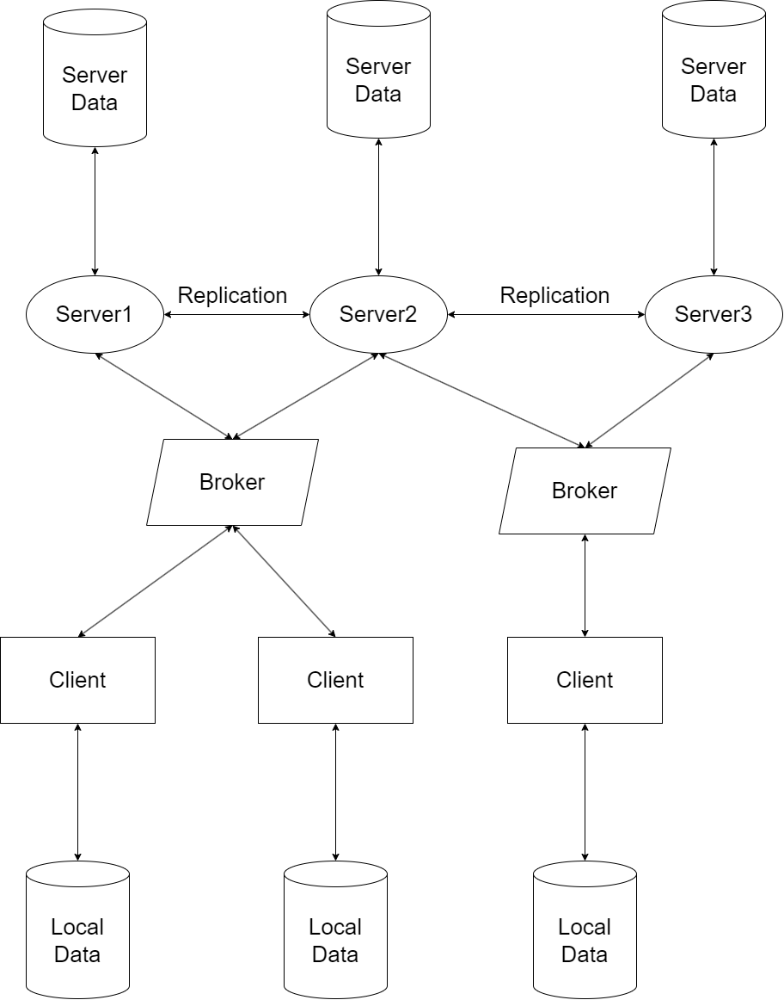

# Armazon - Class 8 Group 1

- Diogo Filipe Ferreira da Silva, up202004288
- Henrique Oliveira Silva, up202007242
- Tiago Nunes Moreira Branquinho, up202005567

---

## Dependencies


### ZeroMQ
```
pip install pyzmq
```

### Tkinter
```
pip install tk
```

### NTP
```
pip install ntplib
```

---

## How to Run System

- Execute the following commands inside **src** directory:

### Clients

```
python cli.py
```

### Brokers

```
python brk.py
```

### Servers

```
python svr.py
```

---

## Planned Project Design

### Frontend

While it may not be of primary importance in this project, we plan to develop a web page using the Python library Flask. Flask can handle incoming data from clients or devices and distribute it to the appropriate components of the distributed system. Users will have the ability to perform all necessary actions through the web page, including adding shopping lists, deleting shopping lists, adding items, and updating quantities. This addition to the project will facilitate testing and demonstration.

### Database Structure

We plan to implement a key-value stores database using SQLite. That way, each shopping list id, representing a key generated with UUID4 will be associated to JSON data which includes the items present in that shopping list. This approach will eliminate the need for relational queries associated with structured relational databases. Altough those models allow for strong consistency on data, they also cause inefficiencies, limiting scaling and availability.

### Server Structure

To satisfy the need of creating a local-first shopping list application that allows data sharing among users, it is intended to implement a decentralized distributed architeture. 
Data storage will be distributed across multiple nodes, which will be able to communicate among themselves to allow data replication, thus providing fault tolerance and reducing data access times. The replication will be asynchronous, indicating that it is designed to be an eventually consistent data store, ensuring that all updates reach all replicas eventually. This process typically occurs in batches at predefined intervals, triggered only if the master node has been updated in the meantime.

Each shopping list undergoes consistent hashing, ensuring that requests consistently access the same server node and promoting load balancing. In the event of a failure, the system detects it through timeouts, initiating a search for a node containing a replica. Replicas are strategically placed in nodes with the immediately prior index to the master node in the consistent hashing ring, optimizing the search process during failures.

### Client Interaction

Clients will hold a local data storage, that will remain updated even in case of server failure and will allow to update the server data once it is back to availability.
Clients should also be able to access the same shopping list concurrently and it should be “always writeable”, where no updates are rejected due to failures or concurrent writes.
<div style="page-break-after: always;"></div>


### Conflict Handling

At any point, if data discrepancies occur among any participants in the system (either between servers or between clients and servers), a merge process will be initiated. In the event of conflicts, the most recently updated data will take precedence. Conflicts between data are resolved by CRDTs during read operations, ensuring that write operations are never rejected, to protect user experience.

### Methods

- get(key) and put(key, context, object), objects(shopping list data) are associated with a key(shopping list ID).
- get:
    - Locates object replicas associated with the provided key in the storage system.
    - Returns a single object, along with a context.
- put:
    - The placement of replicas are determined based on the key.
        - Utilizes MD5 hash to generate a 128-bit identifier from the key.
    - Writes the replicas to disk.
    - The context, which encodes system metadata about the object and its version, is stored along with the object. This enables the system to verify the validity of the context object.

### CRDTs

First we will start by implementing the [LWW-Element-Set](https://shuvoshaha7.medium.com/lww-element-set-9afff3310819) CRDT. In the future, depending on the project's status, we will consider adapting to the [DeltaCrdt](https://hexdocs.pm/delta_crdt/DeltaCrdt.html), since it doesn't require transmission of its state with every change made, only of its delta. That would be very positive due to the scalability requirements.


<div style="page-break-after: always;"></div>


## Anexes

### Sistem Design Diagram




This is a reduced example of the design architeture. In a larger scale each shopping list should contain more replicas.
